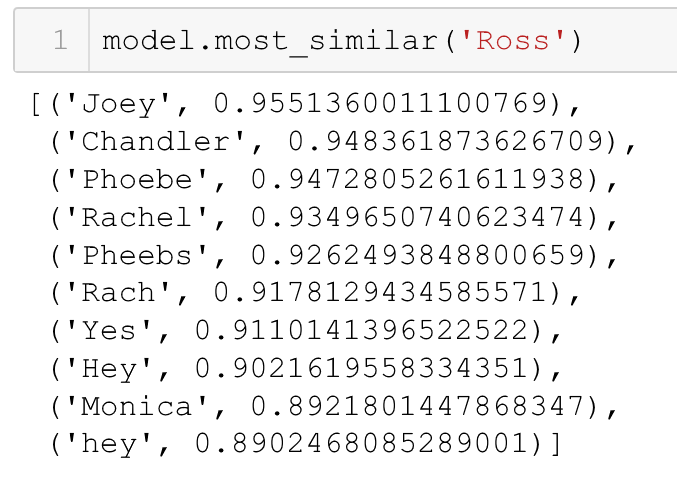
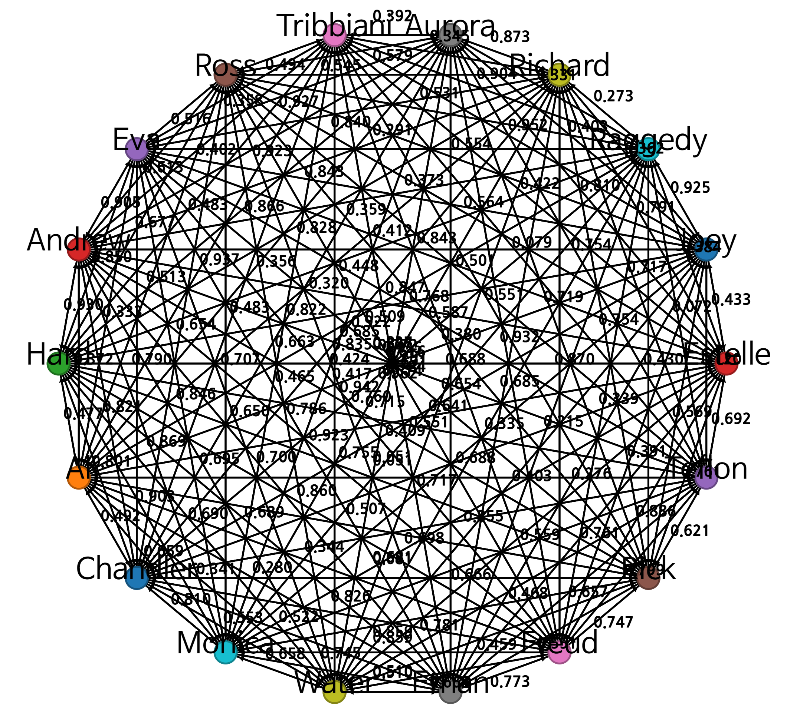

# Word embeddings for Subtitles

- I'm currently using subtitles data from *Friends*.

## Tasks
- POS tagging to find actors, locations in subtitles
  - NLTK supports `ne_chunk` to find named entities
  - [http://www.nltk.org/book/ch07.html](http://www.nltk.org/book/ch07.html)
- Gensim Word2Vec   
  - `model=Word2Vec(sentences)`     
    - `model.init_sims(replace=True)`       
      - Remove useless memory (memory optimization)   
  - `model.most_similar('Apple')`     
    - Retrieve most similar words to 'Apple'.

## Data
- Friends subtitles (Season 1-10)
  - [http://www.subscene.co.in/tv-shows/friends-subtitles.html](http://www.subscene.co.in/tv-shows/friends-subtitles.html)
  - Season 2, 3, 4, 5, 8, 9 -> SUB file (.sub)
  - Season 1, 6, 7, 10 -> SRT file (.srt)

## Word2Vec Results

- gensim word2vec model shows that a main character Ross is very similar to other ones such as Joey, Chandler, etc.

- This image represents a weighted graph for 18 persons which are considered as PERSON named entities. The weight here is calculted by word2vec similarity. 
- Note that a simple version of gensim word2vec (with no hand-craft engineering) was not able to catch people correctly. For example, *Hard* is not apparently a person.
